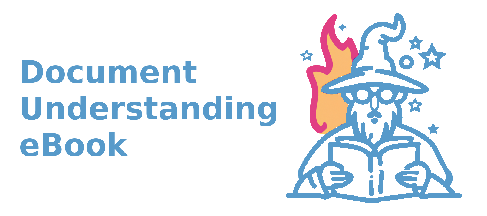

# Experience

My background is in machine learning engineering with a specialization in document understanding, system architecture, and event-driven orchestration engines.

## Professional Timeline

<table>
  <tr>
    <td></td>
    <td><a href="https://www.jpmorgan.com/global">J.P Morgan</a></td>
    <td>Lead Software Engineer, Vice President, Corporate Investment Bank</td>
    <td>2017-</td>
  </tr>
  <tr>
    <td></td>
    <td><a href="https://www.temple.edu">Temple University</a></td>
    <td>Adjunct Professor, College of Science and Technology</td>
    <td>2022-</td>
  </tr>
</table>

# Education

## Degrees

<table>
  <tr>
    <td></td>
    <td><a href="https://www.msds.udel.edu/">University of Delaware</a></td>
    <td>Master of Science, Data Science</td>
    <td>2022</td>
  </tr>
  <tr>
    <td></td>
    <td><a href="https://www.temple.edu">Temple University</a></td>
    <td>Bachelor of Science, Information Science and Technology</td>
    <td>2017</td>
  </tr>
</table>

# Teaching

I am currently an adjunct professor at Temple University teaching the Information Science & Technology capstone course Information Systems Analysis and Design - CIS4296.

Previously, I have taught the Information Science & Technology capstone course Information Systems Implementation - CIS4396.

You can find more [here.](https://sites.temple.edu/horvay/)

# Projects

I have been actively developing projects on [GitHub](https://github.com/dhorvay).

<a class="github-button" href="https://github.com/dhorvay" data-show-count="true" aria-label="Follow @dhorvay on GitHub">Follow @dhorvay</a>
## Active Development
<table>
  <tr>
    <td></td>
    <td><a href="https://horvay.dev/document-understanding-ebook">Document Understanding eBook</a></td>
    <td>
<a class="github-button" href="https://github.com/dhorvay/document-understanding-ebook" data-icon="octicon-star" aria-label="Star dhorvay/document-understanding-ebook on GitHub">Star</a></td>
  </tr>
</table>
